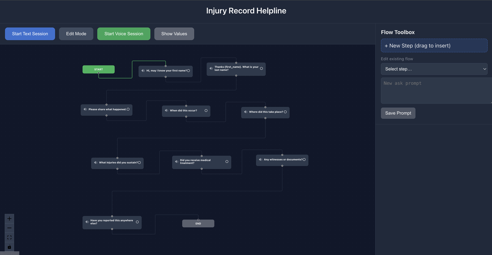
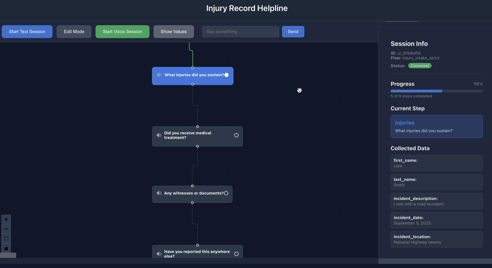

# Personal Injury Agent





This project includes:

Langgraph , Supabase , Livekit , Reactflow 

## Dev Setup

Install dependencies to a virtual environment:

```console
cd agent-starter-python
uv sync
```

Set up the environment by copying `.env.example` to `.env.local` and filling in the required values:

- `LIVEKIT_URL`: Use [LiveKit Cloud](https://cloud.livekit.io/) or [run your own](https://docs.livekit.io/home/self-hosting/)
- `LIVEKIT_API_KEY`
- `LIVEKIT_API_SECRET`
- `OPENAI_API_KEY`: [Get a key](https://platform.openai.com/api-keys) or use your [preferred LLM provider](https://docs.livekit.io/agents/integrations/llm/)
- `DEEPGRAM_API_KEY`: [Get a key](https://console.deepgram.com/) or use your [preferred STT provider](https://docs.livekit.io/agents/integrations/stt/)
- `CARTESIA_API_KEY`: [Get a key](https://play.cartesia.ai/keys) or use your [preferred TTS provider](https://docs.livekit.io/agents/integrations/tts/)

You can load the LiveKit environment automatically using the [LiveKit CLI](https://docs.livekit.io/home/cli/cli-setup):

```bash
lk app env -w .env.local
```

## Run the agent

Before your first run, you must download certain models such as [Silero VAD](https://docs.livekit.io/agents/build/turns/vad/) and the [LiveKit turn detector](https://docs.livekit.io/agents/build/turns/turn-detector/):

```console
uv run python src/agent.py download-files
```

Next, run this command to speak to your agent directly in your terminal:

```console
uv run python src/agent.py console
```

To run the agent for use with a frontend or telephony, use the `dev` command:

```console
uv run python src/agent.py dev
```

In production, use the `start` command:

```console
uv run python src/agent.py start
```
# Intake Flow Visualizer

A React Flow-based visualization tool for your LangGraph + Supabase injury intake process.

## 🎯 What This Shows

This React application provides a **real-time visual representation** of your existing intake flow:

- **Visual Flow Diagram**: See each step of your LangGraph intake process
- **Real-time Progress**: Track which step the user is currently on
- **Data Collection**: View collected answers as they come in
- **Session Management**: Monitor active intake sessions

## 🏗️ Architecture Overview

```
┌─────────────────────┐    ┌──────────────────────┐    ┌─────────────────────┐
│   React Flow UI     │    │   Python Backend     │    │     Supabase        │
│                     │    │                      │    │                     │
│ • Visual flow       │◄──►│ • StrictIntakeAsst   │◄──►│ • flows table       │
│ • Real-time updates │    │ • LangGraph          │    │ • intake_steps      │
│ • Session panel     │    │ • LiveKit voice      │    │ • intake_runs       │
│ • Progress tracking │    │ • WebSocket events   │    │ • intake_answers    │
└─────────────────────┘    └──────────────────────┘    └─────────────────────┘
```

## 🔄 How Your Existing Flow Works

Your current system uses:

1. **Database-Driven Steps**: Flow steps are stored in Supabase (`flows` + `intake_steps` tables)
2. **LangGraph Structure**: Each step creates `ask_{step}` and `store_{step}` nodes
3. **Voice Interface**: LiveKit handles voice input/output
4. **State Management**: LangGraph manages conversation state with checkpointing

## 📊 What the Visualization Shows

### Node Types
- **🟢 START**: Entry point of the flow
- **🔵 ASK Nodes**: Questions being asked to the user (from your `ask_prompt`)
- **🟣 STORE Nodes**: Data storage operations (saving to Supabase)
- **🔴 END**: Flow completion

### Visual States
- **🟦 Active**: Currently executing step (blue border)
- **✅ Completed**: Finished steps (green background)  
- **⭕ Pending**: Not yet reached (gray)
- **📝 Data**: Shows collected values in each node

## 🚀 Running the Visualization

```bash
# Start the React app
cd flow_ui
npm start
```

The app runs on `http://localhost:3000` and shows:
- Interactive flow diagram with zoom/pan
- Real-time session panel
- Progress tracking
- Collected data display

## Frontend & Telephony

Get started quickly with our pre-built frontend starter apps, or add telephony support:

| Platform | Link | Description |
|----------|----------|-------------|
| **Web** | React & Next.js | Web voice AI assistant |
| **iOS/macOS** | Swift | Native iOS, macOS, and visionOS voice AI assistant |
| **Flutter** | Flutter | Cross-platform voice AI assistant app |
| **React Native** | React Native & Expo | Native mobile app |
| **Android** | Kotlin & Jetpack Compose | Native Android app |
| **Web Embed** | JavaScript | Voice AI widget for any website |
| **Telephony** | [📚 Documentation](https://docs.livekit.io/agents/start/telephony/) | Add inbound or outbound calling to your agent |

For advanced customization, see the [complete frontend guide](https://docs.livekit.io/agents/start/frontend/).

## Tests and evals

This project includes a complete suite of evals, based on the LiveKit Agents [testing & evaluation framework](https://docs.livekit.io/agents/build/testing/). To run them, use `pytest`.

```console
uv run pytest
```

## Configuration

For production deployment:

1. **Check in your `uv.lock`**: Commit this file to your repository for reproducible builds and proper configuration management.

2. **Set up environment variables**: Ensure all required API keys and configuration values are properly set in your deployment environment.

3. **Commands to run the code**:Run teh console mode command , install sdk so you can hear audio in console mode. Then for react flow do npm run , build , start. 

## Deploying to production

This project is production-ready and includes a working `Dockerfile`. To deploy it to LiveKit Cloud or another environment, see the [deploying to production](https://docs.livekit.io/agents/ops/deployment/) guide.

## License

This project is licensed under the MIT License - see the [LICENSE](LICENSE) file for details.